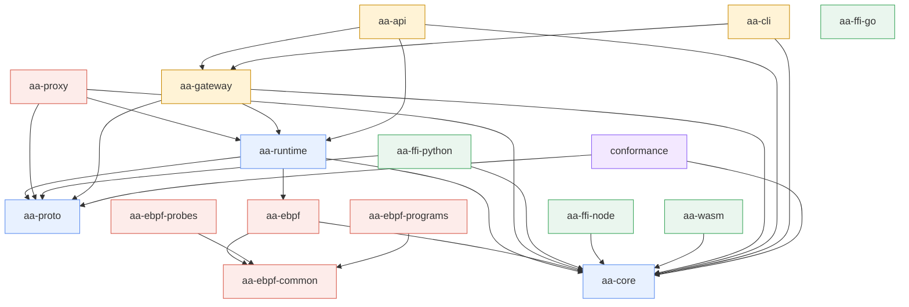

# Architecture Overview

This chapter describes how `agent-assembly` is composed and how its parts interact at runtime.

## Crate dependency graph

The Cargo workspace contains 16 member crates. Edges in the diagram below are derived from `path` dependencies declared in each crate's `Cargo.toml`.

`aa-ffi-go` has no Cargo dependencies on other workspace crates — it talks to the gateway over gRPC at runtime, with bindings generated from the same `proto/` source as `aa-proto`.
