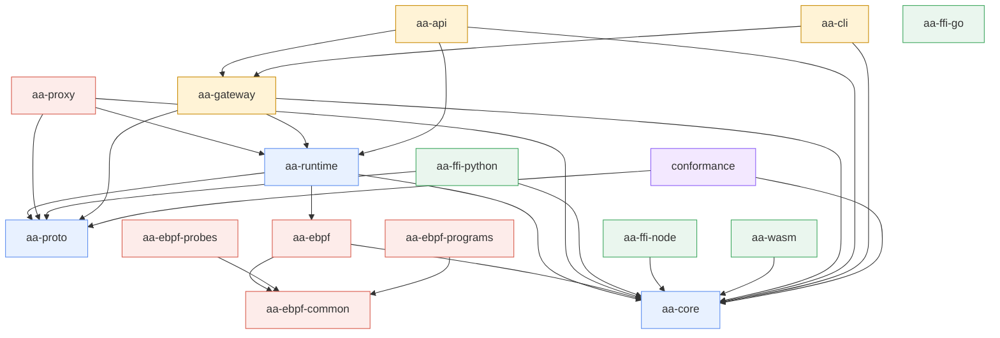
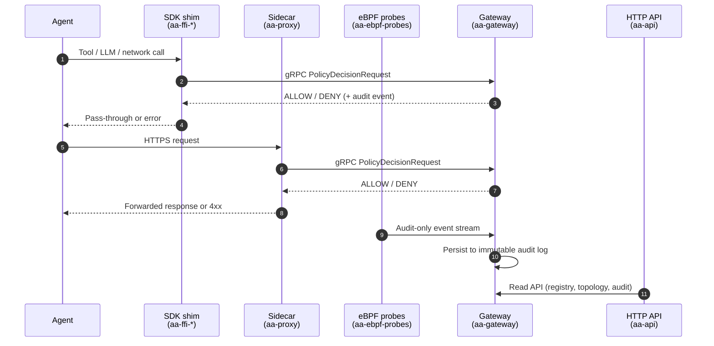
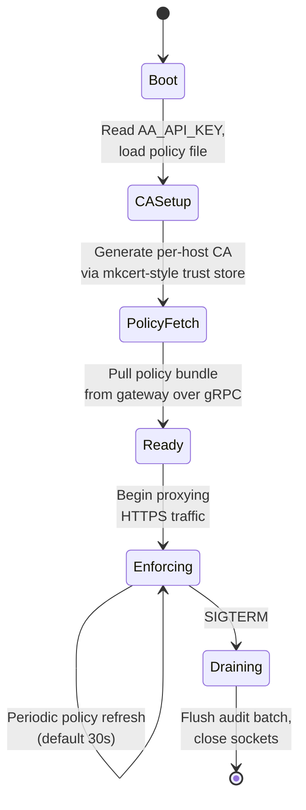

# Architecture Overview

This chapter describes how `agent-assembly` is composed and how its parts interact at runtime.

## Crate dependency graph

The Cargo workspace contains 16 member crates. Edges in the diagram below are derived from `path` dependencies declared in each crate's `Cargo.toml`.

`aa-ffi-go` has no Cargo dependencies on other workspace crates — it talks to the gateway over gRPC at runtime, with bindings generated from the same `proto/` source as `aa-proto`.

## Three-layer interception model

`agent-assembly` enforces governance at three independently-deployable layers, ordered lowest-latency first and highest-detection-authority first:

| Layer | Crate(s) | Where it runs | Bypass risk | Tradeoff |
|---|---|---|---|---|
| **1 — In-process SDK** | `aa-ffi-python`, `aa-ffi-node`, `aa-ffi-go`, `aa-wasm` | Inside the agent process | Highest (agent could skip the SDK) | Fastest path; requires SDK adoption |
| **2 — Sidecar proxy** | `aa-proxy` | Adjacent process / sidecar container | Medium (network egress only) | Catches everything routed through the proxy without code changes |
| **3 — eBPF** | `aa-ebpf`, `aa-ebpf-common`, `aa-ebpf-probes`, `aa-ebpf-programs` | Linux kernel | Lowest (catches bypass attempts) | Linux-only; requires elevated privileges |

Layers compose: a deployment can run any subset. Audit events from each layer carry the same wire format defined in `aa-proto`, so the gateway sees a single unified view regardless of which layer produced an event.

## IPC flow

The gateway is the central control plane. Each interception layer reaches it through a different transport, but all messages share the protobuf schema in `aa-proto`:

- **SDK ↔ Gateway**: synchronous gRPC over Unix domain socket (default `/tmp/aa-runtime-<agent-id>.sock`) or TCP for cross-host deployments. Request and response types live in `aa-proto`.
- **Proxy ↔ Gateway**: same gRPC client surface as the SDK; the proxy adapts inbound HTTPS into `PolicyDecisionRequest` calls.
- **eBPF ↔ Gateway**: one-way audit events; eBPF cannot block in-kernel for bypass-detection use cases — it observes and forwards.
- **API ↔ Gateway**: in-process — `aa-api` depends on `aa-gateway` directly and exposes its read APIs over HTTP via `utoipa`.

## Sidecar lifecycle

`aa-proxy` runs as a sidecar adjacent to the agent. Its lifecycle has five phases:

| Phase | What happens |
|---|---|
| **Boot** | Read environment (`AA_API_KEY`, `AA_GATEWAY_ADDR`, `AA_AGENT_ID`) and the policy file at `/etc/aa/policy.toml` (or `AA_POLICY_PATH`). |
| **CA Setup** | Generate or load a per-host CA used to MitM HTTPS for governed destinations. The agent must trust this CA — the docker-compose example mounts it from a shared volume. |
| **Policy Fetch** | Open a gRPC stream to `aa-gateway`; receive the active policy bundle. Cache locally for offline survivability. |
| **Enforcing** | Forward outbound HTTPS, calling `PolicyDecisionRequest` on the gateway for governed action types. Allowed traffic is re-encrypted with the upstream certificate the proxy verified itself. |
| **Draining** | On `SIGTERM`, stop accepting new connections, finish in-flight requests, flush the audit batch, then exit. |

Health and metrics are exposed at `http://localhost:8080/healthz` and `/metrics` (Prometheus format) throughout the Enforcing phase.
